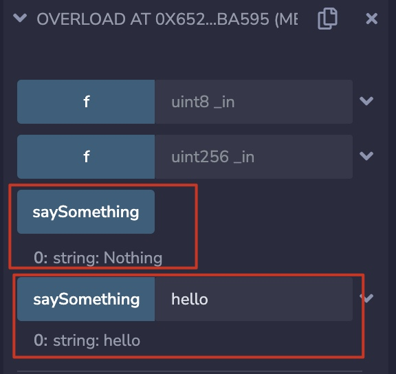

# 16. 函数重载


## 重载

`Solidity`中允许函数进行重载（`overloading`），即名字相同但输入参数类型不同的函数可以同时存在，他们被视为不同的函数。注意，`Solidity`不允许修饰器（`modifier`）重载。

### 函数重载

举个例子，我们可以定义两个都叫`saySomething()`的函数，一个没有任何参数，输出`"Nothing"`；另一个接收一个`string`参数，输出这个`string`。

```solidity
function saySomething() public pure returns(string memory){
    return("Nothing");
}

function saySomething(string memory something) public pure returns(string memory){
    return(something);
}
```

最终重载函数在经过编译器编译后，由于不同的参数类型，都变成了不同的函数选择器（selector）。

以 `Overloading.sol` 合约为例，在 Remix 上编译部署后，分别调用重载函数 `saySomething()` 和 `saySomething(string memory something)`，可以看到他们返回了不同的结果，被区分为不同的函数。



### 实参匹配（Argument Matching）

在调用重载函数时，会把输入的实际参数和函数参数的变量类型做匹配。
如果出现多个匹配的重载函数，则会报错。下面这个例子有两个叫`f()`的函数，一个参数为`uint8`，另一个为`uint256`：

```solidity
function f(uint8 _in) public pure returns (uint8 out) {
    out = _in;
}

function f(uint256 _in) public pure returns (uint256 out) {
    out = _in;
}
```

我们调用`f(50)`，因为`50`既可以被转换为`uint8`，也可以被转换为`uint256`，因此会报错。

## 完整合约
```solidity

// SPDX-License-Identifier: MIT
pragma solidity ^0.8.21;
    contract Overload {
    function saySomething() public pure returns(string memory){
        return("Nothing");
    }

    function saySomething(string memory something) public pure returns(string memory){
        return(something);
    }

    function f(uint8 _in) public pure returns (uint8 out) {
        out = _in;
    }

    function f(uint256 _in) public pure returns (uint256 out) {
        out = _in;
    }
}
```