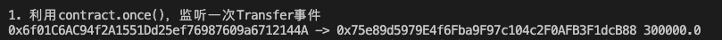
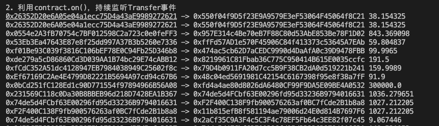

# 8. 监听合约事件


## 监听合约事件

### `contract.on`
在`ethersjs`中，合约对象有一个`contract.on`的监听方法，让我们持续监听合约的事件：

```js
contract.on("eventName", function)
```
`contract.on`有两个参数，一个是要监听的事件名称`"eventName"`，需要包含在合约`abi`中；另一个是我们在事件发生时调用的函数。

### contract.once

合约对象有一个`contract.once`的监听方法，让我们只监听一次合约释放事件，它的参数与`contract.on`一样：

```js
contract.once("eventName", function)
```

## 监听`USDT`合约

1. 声明`provider`：Alchemy是一个免费的ETH节点提供商。需要先申请一个，后续会用到。

  ```js
  import { ethers } from "ethers";
  // 准备 alchemy API

  const ALCHEMY_MAINNET_URL = 'https://eth-mainnet.g.alchemy.com/v2/oKmOQKbneVkxgHZfibs-iFhIlIAl6HDN';
  // 连接主网 provider
  const provider = new ethers.JsonRpcProvider(ALCHEMY_MAINNET_URL);
  ```

2. 声明合约变量：我们只关心`USDT`合约的`Transfer`事件，把它填入到`abi`中就可以。如果你关心其他函数和事件的话，可以在[etherscan](https://etherscan.io/address/0xdac17f958d2ee523a2206206994597c13d831ec7#code)上找到。

  ```js
  // USDT的合约地址
  const contractAddress = '0xdac17f958d2ee523a2206206994597c13d831ec7'
  // 构建USDT的Transfer的ABI
  const abi = [
    "event Transfer(address indexed from, address indexed to, uint value)"
  ];
  // 生成USDT合约对象
  const contractUSDT = new ethers.Contract(contractAddress, abi, provider);
  ```

3. 利用`contract.once()`函数，监听一次`Transfer`事件，并打印结果。

  ```js
    // 只监听一次
    console.log("\n1. 利用contract.once()，监听一次Transfer事件");
    contractUSDT.once('Transfer', (from, to, value)=>{
      // 打印结果
      console.log(
        `${from} -> ${to} ${ethers.formatUnits(ethers.getBigInt(value),6)}`
      )
    })
  ```
  

4. 利用`contract.on()`函数，持续监听`Transfer`事件，并打印结果。
  ```js
    // 持续监听USDT合约
    console.log("\n2. 利用contract.on()，持续监听Transfer事件");
    contractUSDT.on('Transfer', (from, to, value)=>{
      console.log(
       // 打印结果
       `${from} -> ${to} ${ethers.formatUnits(ethers.getBigInt(value),6)}`
      )
    })
  ```
  

## 完整代码
```js
// 监听合约方法：
// 1. 持续监听
// contractUSDT.on("事件名", Listener)
// 2. 只监听一次
// contractUSDT.once("事件名", Listener)

import { ethers } from "ethers";

// 准备 alchemy API

const ALCHEMY_MAINNET_URL = 'https://eth-mainnet.g.alchemy.com/v2/oKmOQKbneVkxgHZfibs-iFhIlIAl6HDN';
// 连接主网 provider
const provider = new ethers.JsonRpcProvider(ALCHEMY_MAINNET_URL);

// USDT的合约地址
const contractAddress = '0xdac17f958d2ee523a2206206994597c13d831ec7'
// 构建USDT的Transfer的ABI
const abi = [
  "event Transfer(address indexed from, address indexed to, uint value)"
];
// 生成USDT合约对象
const contractUSDT = new ethers.Contract(contractAddress, abi, provider);


const main = async () => {
  // 监听USDT合约的Transfer事件

  try{
    // 只监听一次
    console.log("\n1. 利用contract.once()，监听一次Transfer事件");
    contractUSDT.once('Transfer', (from, to, value)=>{
      // 打印结果
      console.log(
        `${from} -> ${to} ${ethers.formatUnits(ethers.getBigInt(value),6)}`
      )
    })

    // 持续监听USDT合约
    console.log("\n2. 利用contract.on()，持续监听Transfer事件");
    contractUSDT.on('Transfer', (from, to, value)=>{
      console.log(
       // 打印结果
       `${from} -> ${to} ${ethers.formatUnits(ethers.getBigInt(value),6)}`
      )
    })

  }catch(e){
    console.log(e);

  }
}
main()
```
