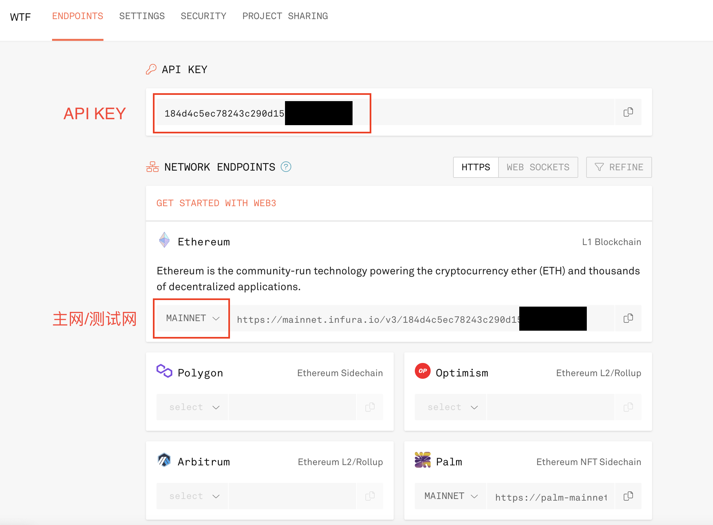
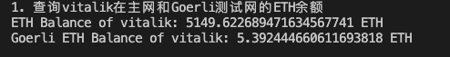
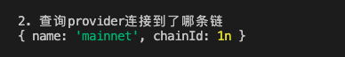
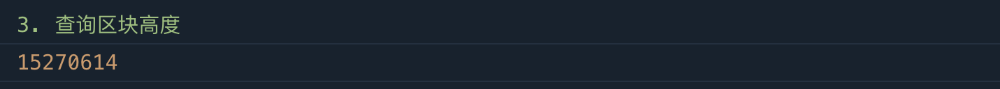
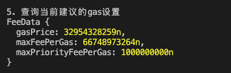
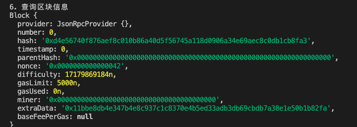
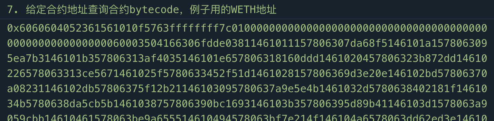

# Provider 提供器


## `Provider`类

`Provider`类是对以太坊网络连接的抽象，为标准以太坊节点功能提供简洁、一致的接口。在`ethers`中，`Provider`不接触用户私钥，只能读取链上信息，不能写入，这一点比`web3.js`要安全。

除了[之前](https://github.com/WTFAcademy/WTF-Ethers)介绍的默认提供者`defaultProvider`以外，`ethers`中最常用的是`jsonRpcProvider`，可以让用户连接到特定节点服务商的节点。

## `jsonRpcProvider`

### 创建节点服务商的API Key

首先，你需要去节点服务商的网站注册并创建`API Key`。在`WTF Solidity极简教程`的工具篇，我们介绍了[Infura](https://github.com/AmazingAng/WTFSolidity/blob/main/Topics/Tools/TOOL02_Infura/readme.md)和[Alchemy](https://github.com/AmazingAng/WTFSolidity/blob/main/Topics/Tools/TOOL04_Alchemy/readme.md)两家公司`API Key`的创建方法，大家可以参考。



你还可以在 [Chainlist](https://chainlist.org/) 网站找到各个链的公开节点。

### 连接公开节点

这里，我们用[Chainlist](https://chainlist.org/)上的公开节点作为例子。在找到合适的rpc之后，可以利用`ethers.JsonRpcProvider()`方法来创建`Provider`变量，该方法以节点服务的`url`链接作为参数。

在下面这个例子中，我们分别创建连接到`ETH`主网和`Sepolia`测试网的`provider`：

```javascript
// 利用公共rpc节点连接以太坊网络
// 可以在 https://chainlist.org 上找到
const ALCHEMY_MAINNET_URL = 'https://rpc.ankr.com/eth';
const ALCHEMY_SEPOLIA_URL = 'https://rpc.sepolia.org';
// 连接以太坊主网
const providerETH = new ethers.JsonRpcProvider(ALCHEMY_MAINNET_URL)
// 连接Sepolia测试网
const providerSepolia = new ethers.JsonRpcProvider(ALCHEMY_SEPOLIA_URL)
```

### 利用`Provider`读取链上数据

`Provider`类封装了一些方法，可以便捷的读取链上数据：

**1.** 利用`getBalance()`函数读取主网和测试网Vitalik的`ETH`余额（测试网目前不支持`ENS`域名，只能用钱包地址查询）：

```javascript
    // 1. 查询vitalik在主网和Sepolia测试网的ETH余额
    console.log("1. 查询vitalik在主网和Sepolia测试网的ETH余额");
    const balance = await providerETH.getBalance(`vitalik.eth`);
    const balanceSepolia = await providerSepolia.getBalance(`0xd8dA6BF26964aF9D7eEd9e03E53415D37aA96045`);
    // 将余额输出在console（主网）
    console.log(`ETH Balance of vitalik: ${ethers.formatEther(balance)} ETH`);
    // 输出Sepolia测试网ETH余额
    console.log(`Sepolia ETH Balance of vitalik: ${ethers.formatEther(balanceSepolia)} ETH`);
```



**2.** 利用`getNetwork()`查询`provider`连接到了哪条链，`homestead`代表`ETH`主网：

```javascript
    // 2. 查询provider连接到了哪条链
    console.log("\n2. 查询provider连接到了哪条链")
    const network = await providerETH.getNetwork();
    console.log(network.toJSON());
```
> ethers v6版本, 以上代码中`network`不能直接`console.log()`, 具体原因参考: [discussion-3977](https://github.com/ethers-io/ethers.js/discussions/3977)



**3.** 利用`getBlockNumber()`查询当前区块高度：

```javascript
    // 3. 查询区块高度
    console.log("\n3. 查询区块高度")
    const blockNumber = await providerETH.getBlockNumber();
    console.log(blockNumber);
```



**4.** 利用`getTransactionCount()`查询某个钱包的历史交易次数。

```javascript
    // 4. 查询 vitalik 钱包历史交易次数
    console.log("\n4. 查询 vitalik 钱包历史交易次数")
    const txCount = await providerETH.getTransactionCount("vitalik.eth");
    console.log(txCount);
```


**5.** 利用`getFeeData()`查询当前建议的`gas`设置，返回的数据格式为`bigint`。

```javascript
    // 5. 查询当前建议的gas设置
    console.log("\n5. 查询当前建议的gas设置")
    const feeData = await providerETH.getFeeData();
    console.log(feeData);
```



**6.** 利用`getBlock()`查询区块信息，参数为要查询的区块高度：

```javascript
    // 6. 查询区块信息
    console.log("\n6. 查询区块信息")
    const block = await providerETH.getBlock(0);
    console.log(block);
```



**7.** 利用`getCode()`查询某个地址的合约`bytecode`，参数为合约地址，下面例子中用的主网`WETH`的合约地址：

```javascript
    // 7. 给定合约地址查询合约bytecode，例子用的WETH地址
    console.log("\n7. 给定合约地址查询合约bytecode，例子用的WETH地址")
    const code = await providerETH.getCode("0xc778417e063141139fce010982780140aa0cd5ab");
    console.log(code);
```



## 完整代码

```js
// 导入ethers包
import { ethers } from "ethers";
// playcode免费版不能安装ethers，用这条命令，需要从网络上import包（把上面这行注释掉）
// import { ethers } from "https://cdn-cors.ethers.io/lib/ethers-5.6.9.esm.min.js";

// 利用公共rpc节点连接以太坊网络
// 可以在 https://chainlist.org 上找到
const ALCHEMY_MAINNET_URL = 'https://rpc.ankr.com/eth';
const ALCHEMY_SEPOLIA_URL = 'https://rpc.sepolia.org';
// 连接以太坊主网
const providerETH = new ethers.JsonRpcProvider(ALCHEMY_MAINNET_URL)
// 连接Sepolia测试网
const providerSepolia = new ethers.JsonRpcProvider(ALCHEMY_SEPOLIA_URL)

const main = async () => {
    // 利用provider读取链上信息
    // 1. 查询vitalik在主网和Sepolia测试网的ETH余额
    console.log("1. 查询vitalik在主网和Sepolia测试网的ETH余额");
    const balance = await providerETH.getBalance(`vitalik.eth`);
    const balanceSepolia = await providerSepolia.getBalance(`0xd8dA6BF26964aF9D7eEd9e03E53415D37aA96045`);
    // 将余额输出在console（主网）
    console.log(`ETH Balance of vitalik: ${ethers.formatEther(balance)} ETH`);
    // 输出Sepolia测试网ETH余额
    console.log(`Sepolia ETH Balance of vitalik: ${ethers.formatEther(balanceSepolia)} ETH`);

    // 2. 查询provider连接到了哪条链
    console.log("\n2. 查询provider连接到了哪条链")
    const network = await providerETH.getNetwork();
    console.log(network.toJSON());

    // 3. 查询区块高度
    console.log("\n3. 查询区块高度")
    const blockNumber = await providerETH.getBlockNumber();
    console.log(blockNumber);

    // 4. 查询 vitalik 钱包历史交易次数
    console.log("\n4. 查询 vitalik 钱包历史交易次数")
    const txCount = await providerETH.getTransactionCount("vitalik.eth");
    console.log(txCount);

    // 5. 查询当前建议的gas设置
    console.log("\n5. 查询当前建议的gas设置")
    const feeData = await providerETH.getFeeData();
    console.log(feeData);

    // 6. 查询区块信息
    console.log("\n6. 查询区块信息")
    const block = await providerETH.getBlock(0);
    console.log(block);

    // 7. 给定合约地址查询合约bytecode，例子用的WETH地址
    console.log("\n7. 给定合约地址查询合约bytecode，例子用的WETH地址")
    const code = await providerETH.getCode("0xc778417e063141139fce010982780140aa0cd5ab");
    console.log(code);

}

main()
```

