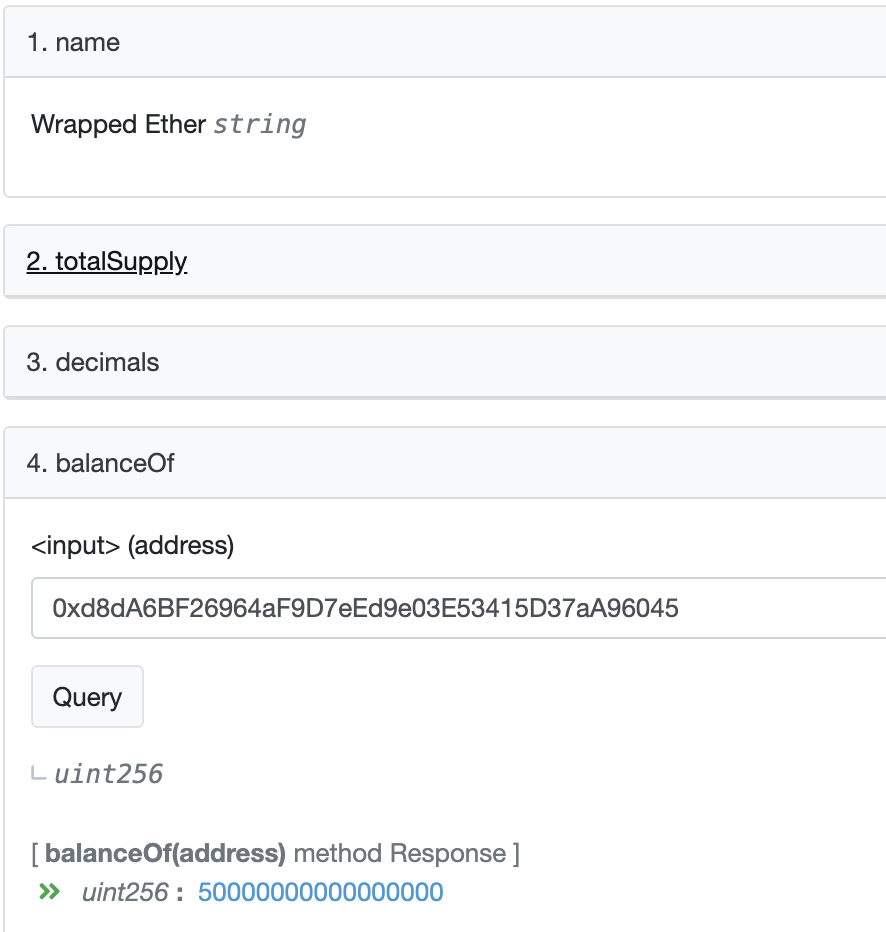

#  读取合约信息

## `Contract`类

在`ethers`中，`Contract`类是部署在以太坊网络上的合约（`EVM`字节码）的抽象。通过它，开发者可以非常容易的对合约进行读取`call`和交易`transaction`，并可以获得交易的结果和事件。以太坊强大的地方正是合约，所以对于合约的操作要熟练掌握。

## 创建`Contract`变量

### 只读和可读写`Contract`

`Contract`对象分为两类，只读和可读写。只读`Contract`只能读取链上合约信息，执行`call`操作，即调用合约中`view`和`pure`的函数，而不能执行交易`transaction`。创建这两种`Contract`变量的方法有所不同：

- 只读`Contract`：参数分别是合约地址，合约`abi`和`provider`变量（只读）。

```javascript
const contract = new ethers.Contract(`address`, `abi`, `provider`);
```

- 可读写`Contract`：参数分别是合约地址，合约`abi`和`signer`变量。`Signer`签名者是`ethers`中的另一个类，用于签名交易，之后我们会讲到。

```javascript
const contract = new ethers.Contract(`address`, `abi`, `signer`);
```

**注意** `ethers`中的`call`指的是只读操作，与`solidity`中的`call`不同。

## 读取合约信息

### 1. 创建Provider

我们使用Infura节点的API Key创建`Provider`（见[第2讲：Provider](./Provider.md)）：
```javascript
import { ethers } from "ethers";
// 利用Infura的rpc节点连接以太坊网络
// 准备Infura API Key, 教程：https://github.com/AmazingAng/WTFSolidity/blob/main/Topics/Tools/TOOL02_Infura/readme.md
const INFURA_ID = ''
// 连接以太坊主网
const provider = new ethers.JsonRpcProvider(`https://mainnet.infura.io/v3/${INFURA_ID}`)
```

### 2. 创建只读Contract实例

创建只读Contract实例需要填入`3`个参数，分别是合约地址，合约`abi`和`provider`变量。合约地址可以在网上查到，`provider`变量上一步我们已经创建了，那么`abi`怎么填？

`ABI` (Application Binary Interface) 是与以太坊智能合约交互的标准，更多内容见[WTF Solidity教程第27讲: ABI编码](https://github.com/AmazingAng/WTF-Solidity/blob/main/27_ABIEncode/readme.md)。`ethers`支持两种`abi`填法：

- **方法1.**  直接输入合约`abi`。你可以从`remix`的编译页面中复制，在本地编译合约时生成的`artifact`文件夹的`json`文件中得到，或者从`etherscan`开源合约的代码页面得到。我们用这个方法创建`WETH`的合约实例：

```javascript
// 第1种输入abi的方式: 复制abi全文
// WETH的abi可以在这里复制：https://etherscan.io/token/0xc02aaa39b223fe8d0a0e5c4f27ead9083c756cc2#code
const abiWETH = '[{"constant":true,"inputs":[],"name":"name","outputs":[{"name":"","type":"string"}],"payable":false,"stateMutability":"view",...太长后面省略...';
const addressWETH = '0xc02aaa39b223fe8d0a0e5c4f27ead9083c756cc2' // WETH Contract
const contractWETH = new ethers.Contract(addressWETH, abiWETH, provider)
```


- **方法2.** 由于`abi`可读性太差，`ethers`创新的引入了`Human-Readable Abi`（人类可读abi）。开发者可以通过`function signature`和`event signature`来写`abi`。我们用这个方法创建稳定币`DAI`的合约实例：

```javascript
// 第2种输入abi的方式：输入程序需要用到的函数，逗号分隔，ethers会自动帮你转换成相应的abi
// 人类可读abi，以ERC20合约为例
const abiERC20 = [
    "function name() view returns (string)",
    "function symbol() view returns (string)",
    "function totalSupply() view returns (uint256)",
    "function balanceOf(address) view returns (uint)",
];
const addressDAI = '0x6B175474E89094C44Da98b954EedeAC495271d0F' // DAI Contract
const contractDAI = new ethers.Contract(addressDAI, abiERC20, provider)
```

### 3. 读取`WETH`和`DAI`的链上信息

我们可以利用只读`Contract`实例调用合约的`view`和`pure`函数，获取链上信息：

```javascript
const main = async () => {
    // 1. 读取WETH合约的链上信息（WETH abi）
    const nameWETH = await contractWETH.name()
    const symbolWETH = await contractWETH.symbol()
    const totalSupplyWETH = await contractWETH.totalSupply()
    console.log("\n1. 读取WETH合约信息")
    console.log(`合约地址: ${addressWETH}`)
    console.log(`名称: ${nameWETH}`)
    console.log(`代号: ${symbolWETH}`)
    console.log(`总供给: ${ethers.formatEther(totalSupplyWETH)}`)
    const balanceWETH = await contractWETH.balanceOf('vitalik.eth')
    console.log(`Vitalik持仓: ${ethers.formatEther(balanceWETH)}\n`)

    // 2. 读取DAI合约的链上信息（IERC20接口合约）
    const nameDAI = await contractDAI.name()
    const symbolDAI = await contractDAI.symbol()
    const totalSupplDAI = await contractDAI.totalSupply()
    console.log("\n2. 读取DAI合约信息")
    console.log(`合约地址: ${addressDAI}`)
    console.log(`名称: ${nameDAI}`)
    console.log(`代号: ${symbolDAI}`)
    console.log(`总供给: ${ethers.formatEther(totalSupplDAI)}`)
    const balanceDAI = await contractDAI.balanceOf('vitalik.eth')
    console.log(`Vitalik持仓: ${ethers.formatEther(balanceDAI)}\n`)
}

main()
```

可以看到，用两种方法创建的合约实例都能成功与链上交互。Vitalik的钱包里有`0.05 WETH`及`555508 DAI`，见下图。


**说明**
我们可以通过[以太坊浏览器](https://etherscan.io/token/0xc02aaa39b223fe8d0a0e5c4f27ead9083c756cc2#readContract) 验证Vitalik钱包里的`WETH`余额, 是否与通过`Contract`读取的一致。 通过[ENS](https://app.ens.domains/name/vitalik.eth/details) 查到Vitalik钱包地址是`0xd8dA6BF26964aF9D7eEd9e03E53415D37aA96045`,然后通过合约方法`balanceOf`得到余额正好是`0.05 WETH`, 结论是一致！


## 完整代码
```js
// 声明只读合约的规则：
// 参数分别为合约地址`address`，合约ABI `abi`，Provider变量`provider`
// const contract = new ethers.Contract(`address`, `abi`, `provider`);

import { ethers } from "ethers";

// 利用Alchemy的rpc节点连接以太坊网络
// 准备 alchemy API 可以参考https://github.com/AmazingAng/WTFSolidity/blob/main/Topics/Tools/TOOL04_Alchemy/readme.md
const ALCHEMY_MAINNET_URL = 'https://eth-mainnet.g.alchemy.com/v2/oKmOQKbneVkxgHZfibs-iFhIlIAl6HDN';
const provider = new ethers.JsonRpcProvider(ALCHEMY_MAINNET_URL);

// 第1种输入abi的方式: 复制abi全文
// WETH的abi可以在这里复制：https://etherscan.io/token/0xc02aaa39b223fe8d0a0e5c4f27ead9083c756cc2#code
const abiWETH = '[{"constant":true,"inputs":[],"name":"name","outputs":[{"name":"","type":"string"}],"payable":false,"stateMutability":"view","type":"function"},{"constant":false,"inputs":[{"name":"guy","type":"address"},{"name":"wad","type":"uint256"}],"name":"approve","outputs":[{"name":"","type":"bool"}],"payable":false,"stateMutability":"nonpayable","type":"function"},{"constant":true,"inputs":[],"name":"totalSupply","outputs":[{"name":"","type":"uint256"}],"payable":false,"stateMutability":"view","type":"function"},{"constant":false,"inputs":[{"name":"src","type":"address"},{"name":"dst","type":"address"},{"name":"wad","type":"uint256"}],"name":"transferFrom","outputs":[{"name":"","type":"bool"}],"payable":false,"stateMutability":"nonpayable","type":"function"},{"constant":false,"inputs":[{"name":"wad","type":"uint256"}],"name":"withdraw","outputs":[],"payable":false,"stateMutability":"nonpayable","type":"function"},{"constant":true,"inputs":[],"name":"decimals","outputs":[{"name":"","type":"uint8"}],"payable":false,"stateMutability":"view","type":"function"},{"constant":true,"inputs":[{"name":"","type":"address"}],"name":"balanceOf","outputs":[{"name":"","type":"uint256"}],"payable":false,"stateMutability":"view","type":"function"},{"constant":true,"inputs":[],"name":"symbol","outputs":[{"name":"","type":"string"}],"payable":false,"stateMutability":"view","type":"function"},{"constant":false,"inputs":[{"name":"dst","type":"address"},{"name":"wad","type":"uint256"}],"name":"transfer","outputs":[{"name":"","type":"bool"}],"payable":false,"stateMutability":"nonpayable","type":"function"},{"constant":false,"inputs":[],"name":"deposit","outputs":[],"payable":true,"stateMutability":"payable","type":"function"},{"constant":true,"inputs":[{"name":"","type":"address"},{"name":"","type":"address"}],"name":"allowance","outputs":[{"name":"","type":"uint256"}],"payable":false,"stateMutability":"view","type":"function"},{"payable":true,"stateMutability":"payable","type":"fallback"},{"anonymous":false,"inputs":[{"indexed":true,"name":"src","type":"address"},{"indexed":true,"name":"guy","type":"address"},{"indexed":false,"name":"wad","type":"uint256"}],"name":"Approval","type":"event"},{"anonymous":false,"inputs":[{"indexed":true,"name":"src","type":"address"},{"indexed":true,"name":"dst","type":"address"},{"indexed":false,"name":"wad","type":"uint256"}],"name":"Transfer","type":"event"},{"anonymous":false,"inputs":[{"indexed":true,"name":"dst","type":"address"},{"indexed":false,"name":"wad","type":"uint256"}],"name":"Deposit","type":"event"},{"anonymous":false,"inputs":[{"indexed":true,"name":"src","type":"address"},{"indexed":false,"name":"wad","type":"uint256"}],"name":"Withdrawal","type":"event"}]';
const addressWETH = '0xc02aaa39b223fe8d0a0e5c4f27ead9083c756cc2' // WETH Contract
const contractWETH = new ethers.Contract(addressWETH, abiWETH, provider)

// 第2种输入abi的方式：输入程序需要用到的函数，逗号分隔，ethers会自动帮你转换成相应的abi
// 人类可读abi，以ERC20合约为例
const abiERC20 = [
    "function name() view returns (string)",
    "function symbol() view returns (string)",
    "function totalSupply() view returns (uint256)",
    "function balanceOf(address) view returns (uint)",
];
const addressDAI = '0x6B175474E89094C44Da98b954EedeAC495271d0F' // DAI Contract
const contractDAI = new ethers.Contract(addressDAI, abiERC20, provider)


const main = async () => {
    // 1. 读取WETH合约的链上信息（WETH abi）
    const nameWETH = await contractWETH.name()
    const symbolWETH = await contractWETH.symbol()
    const totalSupplyWETH = await contractWETH.totalSupply()
    console.log("\n1. 读取WETH合约信息")
    console.log(`合约地址: ${addressWETH}`)
    console.log(`名称: ${nameWETH}`)
    console.log(`代号: ${symbolWETH}`)
    console.log(`总供给: ${ethers.formatEther(totalSupplyWETH)}`)
    const balanceWETH = await contractWETH.balanceOf('vitalik.eth')
    console.log(`Vitalik持仓: ${ethers.formatEther(balanceWETH)}\n`)

    // 2. 读取DAI合约的链上信息（IERC20接口合约）
    const nameDAI = await contractDAI.name()
    const symbolDAI = await contractDAI.symbol()
    const totalSupplDAI = await contractDAI.totalSupply()
    console.log("\n2. 读取DAI合约信息")
    console.log(`合约地址: ${addressDAI}`)
    console.log(`名称: ${nameDAI}`)
    console.log(`代号: ${symbolDAI}`)
    console.log(`总供给: ${ethers.formatEther(totalSupplDAI)}`)
    const balanceDAI = await contractDAI.balanceOf('vitalik.eth')
    console.log(`Vitalik持仓: ${ethers.formatEther(balanceDAI)}\n`)
}

main()
```


