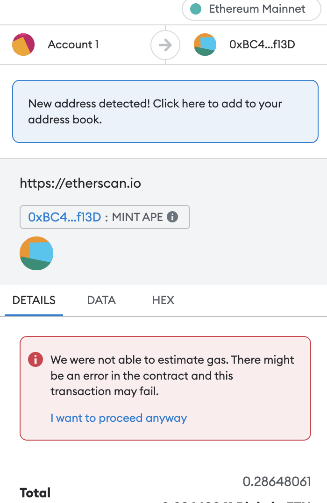
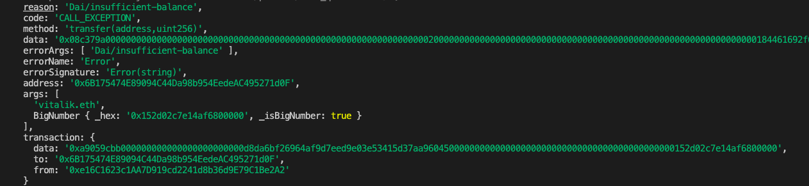

# 11. StaticCall

介绍合约类的`staticCall`方法，在发送交易之前检查交易是否会失败，节省大量gas。

`staticCall`方法是属于```ethers.Contract```类的编写方法分析，同类的还有`populateTransaction`和`estimateGas`方法。

## 可能失败的交易

在以太坊上发交易需要付昂贵的`gas`，并且有失败的风险，发送失败的交易并不会把`gas`返还给你。因此，在发送交易前知道哪些交易可能会失败非常重要。如果你用过`metamask`小狐狸钱包，那对下图不会陌生。



如果你的交易将失败，小狐狸会告诉你`this transaction may fail`，翻译过来就是“这笔交易可能失败”。当用户看到这个红字提示，就知道要取消这笔交易了，除非他想尝尝失败的滋味。

它是怎么做到的呢？这是因为以太坊节点有一个`eth_call`方法，让用户可以模拟一笔交易，并返回可能的交易结果，但不真正在区块链上执行它（交易不上链）。

## `staticCall`

在 ethers.js 中，你可以使用 `contract.函数名.staticCall()` 方法来模拟执行一个可能会改变状态的函数，但不实际向区块链提交这个状态改变。这相当于调用以太坊节点的 `eth_call`。这通常用于模拟状态改变函数的结果。如果函数调用成功，它将返回函数本身的返回值；如果函数调用失败，它将抛出异常。

请注意，这种调用适用于任何函数，无论它在智能合约中是标记为 view/pure 还是普通的状态改变函数。它使你能够安全地预测状态改变操作的结果，而不实际执行这些操作。

```js
    const tx = await contract.函数名.staticCall( 参数, {override})
    console.log(`交易会成功吗？：`, tx)
```

- 函数名：为模拟调用的函数名。
- 参数：调用函数的参数。
- {override}：选填，可包含以下参数：
    - `from`：执行时的`msg.sender`，也就是你可以模拟任何一个人的调用，比如Vitalik。
    - `value`：执行时的`msg.value`。
    - `blockTag`：执行时的区块高度。
    - `gasPrice`
    - `gasLimit`
    - `nonce`

## 用`staticCall`模拟`DAI`转账

1. 创建`provider`和`wallet`对象。
    ```js
    import { ethers } from "ethers";


    const ALCHEMY_MAINNET_URL = 'https://eth-mainnet.g.alchemy.com/v2/oKmOQKbneVkxgHZfibs-iFhIlIAl6HDN';
    const provider = new ethers.JsonRpcProvider(ALCHEMY_MAINNET_URL);

    // 利用私钥和provider创建wallet对象
    const privateKey = '0x227dbb8586117d55284e26620bc76534dfbd2394be34cf4a09cb775d593b6f2b'
    const wallet = new ethers.Wallet(privateKey, provider)
    ```

2. 创建`DAI`合约对象，注意，这里生成合约时要用`provider`而不是`wallet`，不然则不能更改`staticCall`方法中的`from`（可能是bug，也可能是feature）。

    ```js
    // DAI的ABI
    const abiDAI = [
        "function balanceOf(address) public view returns(uint)",
        "function transfer(address, uint) public returns (bool)",
    ];
    // DAI合约地址（主网）
    const addressDAI = '0x6B175474E89094C44Da98b954EedeAC495271d0F' // DAI Contract
    // 创建DAI合约实例
    const contractDAI = new ethers.Contract(addressDAI, abiDAI, provider)
    ```

3. 查看钱包中`DAI`余额，为0。

    ```js
    const address = await wallet.getAddress()
    console.log("\n1. 读取测试钱包的DAI余额")
    const balanceDAI = await contractDAI.balanceOf(address)
    console.log(`DAI持仓: ${ethers.formatEther(balanceDAI)}\n`)
    ```
    

4. 用`staticCall`调用`transfer()`函数，将`from`参数填为Vitalik地址，模拟Vitalik转账`10000 DAI`。这笔交易将成功，因为Vitalik钱包有充足的`DAI`。

    ```js
    console.log("\n2.  用staticCall尝试调用transfer转账1 DAI，msg.sender为Vitalik地址")
    // 发起交易
    const tx = await contractDAI.transfer.staticCall("vitalik.eth", ethers.parseEther("1"), {from:  await provider.resolveName("vitalik.eth")})
    console.log(`交易会成功吗？：`, tx)
    ```
    

4. 用`staticCall`调用`transfer()`函数，将`from`参数填为测试钱包地址，模拟转账`10000 DAI`。这笔交易将失败，报错，并返回原因`Dai/insufficient-balance`。

    ```js
    console.log("\n3.  用staticCall尝试调用transfer转账10000 DAI，msg.sender为测试钱包地址")
    const tx2 = await contractDAI.transfer.staticCall("vitalik.eth", ethers.parseEther("10000"), {from: address})
    console.log(`交易会成功吗？：`, tx2)
    ```
    

## 完整代码
```js
// contract.函数名.staticCall(参数, {override})
import { ethers } from "ethers";


const ALCHEMY_MAINNET_URL = 'https://eth-mainnet.g.alchemy.com/v2/oKmOQKbneVkxgHZfibs-iFhIlIAl6HDN';
const provider = new ethers.JsonRpcProvider(ALCHEMY_MAINNET_URL);

// 利用私钥和provider创建wallet对象
const privateKey = '0x227dbb8586117d55284e26620bc76534dfbd2394be34cf4a09cb775d593b6f2b'
const wallet = new ethers.Wallet(privateKey, provider)

// DAI的ABI
const abiDAI = [
    "function balanceOf(address) public view returns(uint)",
    "function transfer(address, uint) public returns (bool)",
];
// DAI合约地址（主网）
const addressDAI = '0x6B175474E89094C44Da98b954EedeAC495271d0F' // DAI Contract

// 创建DAI合约实例
const contractDAI = new ethers.Contract(addressDAI, abiDAI, provider)

const main = async () => {
    try {
    const address = await wallet.getAddress()
    // 1. 读取DAI合约的链上信息
    console.log("\n1. 读取测试钱包的DAI余额")
    const balanceDAI = await contractDAI.balanceOf(address)
    const balanceDAIVitalik = await contractDAI.balanceOf("vitalik.eth")

    console.log(`测试钱包 DAI持仓: ${ethers.formatEther(balanceDAI)}\n`)
    console.log(`vitalik DAI持仓: ${ethers.formatEther(balanceDAIVitalik)}\n`)

    // 2. 用staticCall尝试调用transfer转账1 DAI，msg.sender为Vitalik，交易将成功
    console.log("\n2.  用staticCall尝试调用transfer转账1 DAI，msg.sender为Vitalik地址")
    // 发起交易
    const tx = await contractDAI.transfer.staticCall("vitalik.eth", ethers.parseEther("1"), {from: await provider.resolveName("vitalik.eth")})
    console.log(`交易会成功吗？：`, tx)

    // 3. 用staticCall尝试调用transfer转账10000 DAI，msg.sender为测试钱包地址，交易将失败
    console.log("\n3.  用staticCall尝试调用transfer转账1 DAI，msg.sender为测试钱包地址")
    const tx2 = await contractDAI.transfer.staticCall("vitalik.eth", ethers.parseEther("10000"), {from: address})
    console.log(`交易会成功吗？：`, tx2)

    } catch (e) {
        console.log(e);
      }
}

main()
```

